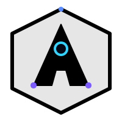
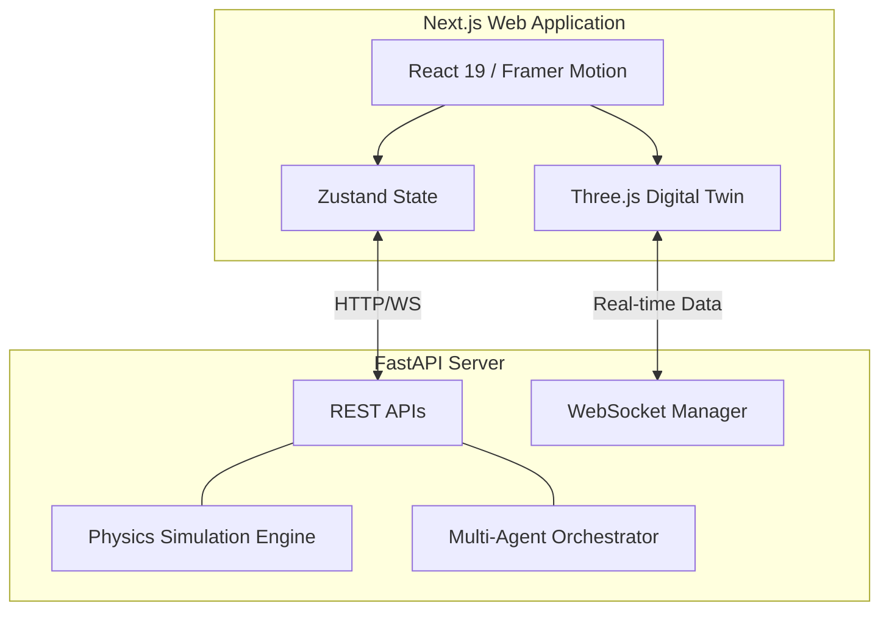

<div align="center">
  
  <h1 align="center">AEGIS : Operational Intelligence Platform</h1>
  <p align="center">
    <strong>Mission-critical stadium management powered by Digital Twins and Multi-Agent Systems.</strong>
  </p>
  
  <p align="center">
    <a href="#-problem-statement">Problem</a> •
    <a href="#-solution-overview">Solution</a> •
    <a href="#-key-features">Features</a> •
    <a href="#-architecture">Architecture</a> •
    <a href="#-quick-start">Quick Start</a>
  </p>
  
  <p align="center">
    <a href="https://github.com/Adi3595/Aegis"></a>
  </p>

  <p align="center">
    
    
    
    
    
  </p>
</div>

---

## 🎯 Problem Statement
Managing large-scale sporting events involves hundreds of disconnected systems, unpredictable crowd behavior, and isolated teams (medical, security, organizers). When an incident occurs, delayed communication and fragmented data can lead to catastrophic failures.

## 💡 Solution Overview
**AEGIS** provides a unified, real-time command center. By combining a **deterministic physics simulation engine** with a live **3D Digital Twin**, it gives stakeholders a comprehensive, god's-eye view of the stadium. A **multi-agent orchestration network** continuously analyzes this data to predict bottlenecks, suggest optimal resource deployment, and automatically coordinate cross-functional teams.

## ✨ Key Features

<details open>
<summary><strong>🎮 Interactive Digital Twin & 3D Terrain</strong></summary>
A fully interactive, Three.js-powered 3D spatial mapping of the stadium that tracks crowd density, heatmaps, and active incidents broadcasted over real-time WebSockets.
</details>

<details open>
<summary><strong>🎭 Unified Persona Login Grid</strong></summary>
Instantly switch between roles (Executive, Organizer, Security, Medical, Volunteer, Fan) using our mock Persona authentication system to test role-based access control.
</details>

<details open>
<summary><strong>🧠 Multi-Agent Orchestration</strong></summary>
Context-aware orchestration for real-time operational advice, featuring an interactive Multi-Agent Network node visualization and Explainability Panel.
</details>

<details open>
<summary><strong>📱 Dedicated Sub-Dashboards</strong></summary>
Tailored UI modules for Analytics, Reports, Settings, Support, and Live Telemetry customized to the specific clearance level of the user.
</details>

## 👥 Supported User Roles
| Persona | Access Clearance | Primary Dashboard Focus |
|---|---|---|
| 🏟️ **Fan** | Level 1 | Navigation, match updates, multilingual support, offline capabilities |
| 🙋 **Volunteer** | Level 2 | Task management, local zone reporting, offline support |
| 🚨 **Security** | Level 3 | Incident triage, live queue monitoring, rapid response |
| ⚕️ **Medical** | Level 3 | Emergency dispatches, triage queues, resource tracking |
| 📋 **Organizer** | Level 4 | Global overview, resource dispatch, timeline management |
| 📈 **Executive** | Level 5 | High-level KPIs, predictive analytics, sustainability metrics |

## 🏗 Architecture



## 🚀 Quick Start

### 🌍 Cloud Deployment (Active)
The project is already live and fully configured!
- **Frontend**: Deployed on Vercel
- **Backend API**: Deployed on Render (`https://aegis-backend-qlx8.onrender.com`)

### 💻 Local Native Development

**1. Clone & Install**
```bash
git clone https://github.com/Adi3595/Aegis.git
cd Aegis
npm install
```

**2. Configure Environment**
Create a `.env.local` file in the root directory:
```env
NEXT_PUBLIC_API_URL=https://aegis-backend-qlx8.onrender.com/api/v1
NEXT_PUBLIC_WS_URL=wss://aegis-backend-qlx8.onrender.com/api/v1
```

**3. Run the Frontend**
```bash
npm run dev
```
Access the application at `http://localhost:3000`.

## 📄 License
This project is licensed under the [MIT License](LICENSE).
