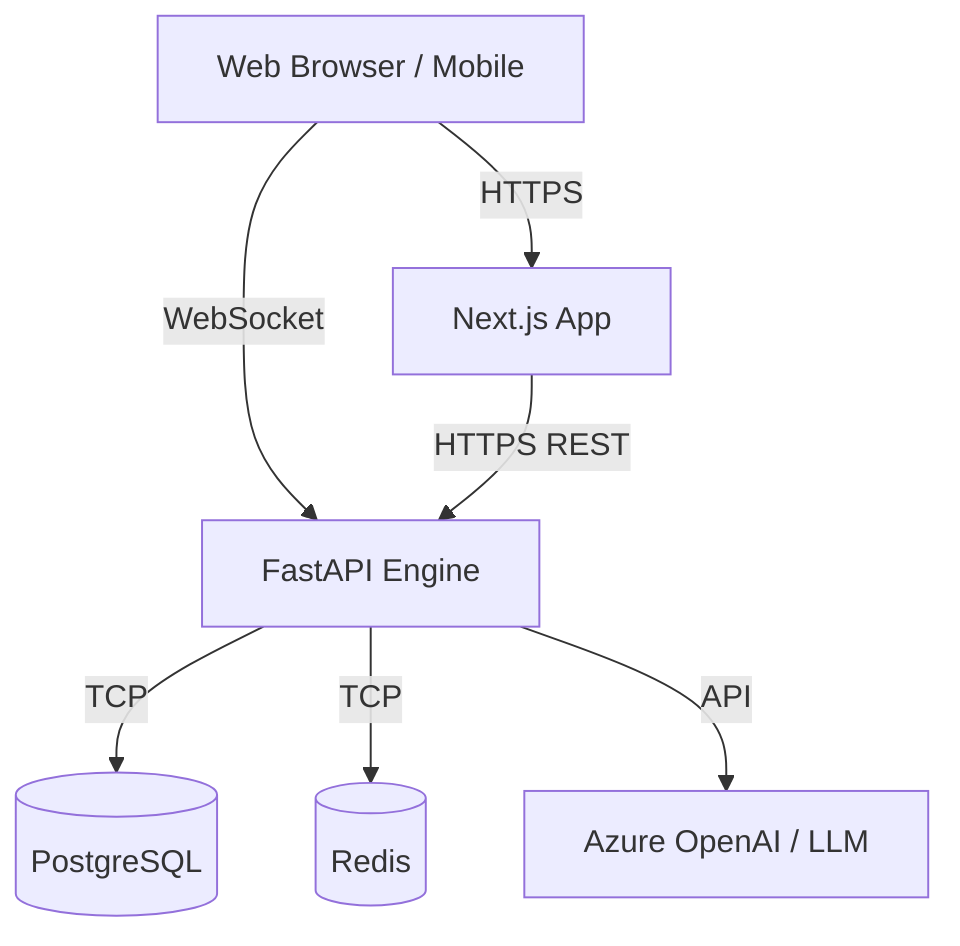
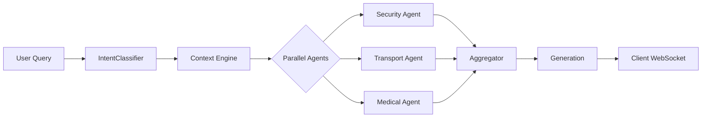

# Architecture Overview

## High-Level System Architecture

AEGIS AI employs a decoupled microservices architecture. The Next.js frontend handles UI, state, and client-side orchestration, while the FastAPI backend serves as the authoritative engine for simulation physics, AI orchestration, and global state.

## Frontend Architecture
- **Framework**: Next.js 15 (App Router)
- **State Management**: Zustand (modular slices: `useAIStore`, `useDigitalTwinStore`, `useDemoStore`)
- **Styling**: Tailwind CSS v4 + Framer Motion (Glassmorphism design system)
- **PWA**: `next-pwa` for offline capabilities (crucial for Fan/Volunteer roles)

## Backend Architecture
- **Framework**: FastAPI (Python 3.12)
- **Concurrency**: `asyncio` for high-throughput WebSocket broadcasting
- **Abstractions**: Provider pattern for AI (`IAIProvider`), Secrets (`ISecretProvider`), and Monitoring (`IMonitoringProvider`). This ensures zero business-logic changes when migrating to managed cloud services.

## AI Orchestration Architecture
The backend simulates a LangGraph multi-agent workflow. 

## WebSocket Architecture
A dedicated `ConnectionManager` handles thousands of concurrent WebSocket connections, broadcasting global ticks (speed, incident updates) every second while maintaining personal channels for AI streaming.

## Authentication Flow
1. User submits credentials to `POST /api/v1/auth/login`.
2. Backend validates against database and returns short-lived `access_token` and long-lived `refresh_token`.
3. Frontend stores tokens securely and attaches them to subsequent HTTP headers and WS connection initializations.
4. Role-based middleware on the backend rejects unauthorized access (e.g., Fan attempting to hit Admin endpoints).

## Deployment Architecture
Optimized for Microsoft Azure using GitHub Actions CI/CD.
- **Frontend**: Azure Static Web Apps or App Service (Standalone Next.js container).
- **Backend**: Azure App Service for Linux.
- **Registry**: GitHub Container Registry (GHCR).
